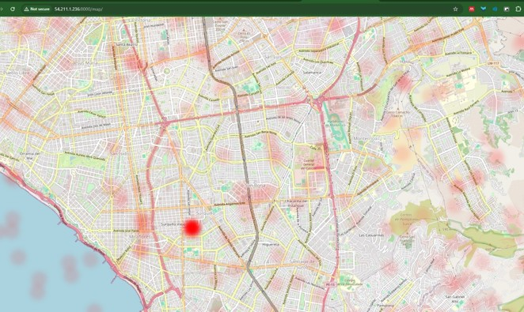
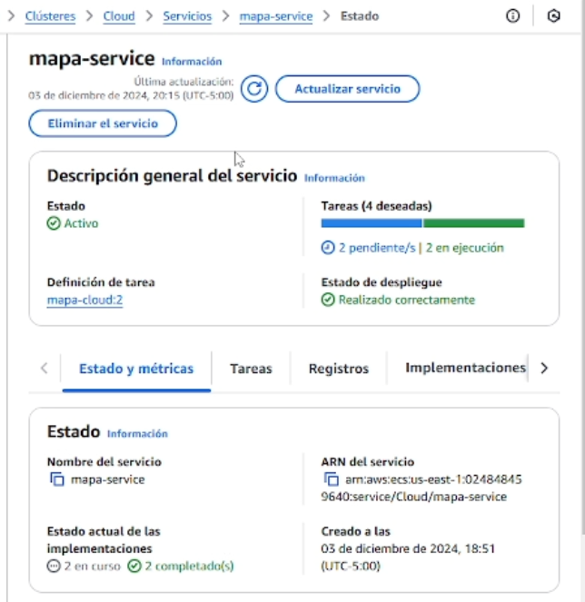
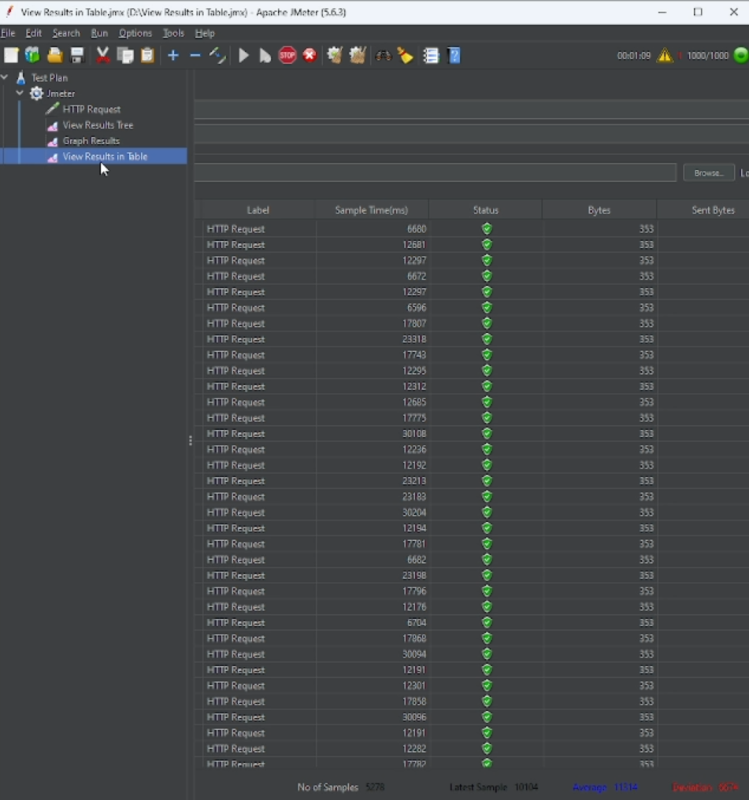

# Proyecto Final Django Cloud computing (CS3P02) 

#### Integrantes:

- Dario Toribio

- Luis Ponce

---
# Visualización de Mapa con Puntos desde AWS DynamoDB

Este proyecto es una aplicación Django que muestra un mapa interactivo con puntos marcados. Los datos de los puntos (latitud y longitud) se obtienen de una tabla en **AWS DynamoDB**. La conexión a AWS se gestiona mediante la biblioteca **boto3**, y las credenciales de AWS se leen desde un archivo `.env` para mayor seguridad.

## Funcionalidades

#### 1. Visualización de un mapa interactivo.




#### 2. Obtención de datos de latitud y longitud desde DynamoDB.
#### 3. Configuración segura de credenciales mediante un archivo `.env`.

## Requisitos

#### 1. Python 3.7 o superior.
#### 2. Bibliotecas de Python necesarias:
   - `Django`
   - `boto3`
   - `python-dotenv`
#### 3. AWS:
   - Acceso a una tabla DynamoDB que contenga las coordenadas (latitud y longitud).
   - Configuración de credenciales AWS con permisos para DynamoDB.

#### Instalación de dependencias

```bash
pip install Django boto3 python-dotenv
```

## Configuración del proyecto

### 1. Clonar el repositorio:
   ```bash
   git clone https://github.com/tu_usuario/tu_repositorio.git
   cd tu_repositorio
   ```

### 2. Configurar las credenciales AWS en el archivo `.env`:
   Crea un archivo `.env` en el directorio raíz del proyecto con el siguiente contenido:
   ```
   AWS_ACCESS_KEY_ID=tu_access_key
   AWS_SECRET_ACCESS_KEY=tu_secret_key
   AWS_REGION_NAME=tu_region
   DYNAMODB_TABLE_NAME=nombre_de_tu_tabla
   ```

### 3. Realizar las migraciones y ejecutar el servidor de desarrollo:
   ```bash
   python manage.py migrate
   python manage.py runserver
   ```

## Uso

#### 1. Accede a la ruta donde se muestra el mapa (por ejemplo, `/mapa/`).
#### 2. El mapa cargará los puntos obtenidos desde DynamoDB automáticamente.

## Estructura del Proyecto

- **`views.py`**: Contiene la lógica para obtener los datos de DynamoDB y renderizar el mapa.
- **`models.py`**: Define los modelos de Django, si se utilizan.
- **`.env`**: Archivo para almacenar las credenciales de AWS.
- **`templates/map.html`**: Archivo HTML que utiliza una librería como Leaflet.js o similar para mostrar el mapa interactivo.

## Conexión a DynamoDB

La conexión a DynamoDB se realiza utilizando la biblioteca **boto3**. Un ejemplo de implementación en `views.py` es:

```python
import boto3
import os
from dotenv import load_dotenv

load_dotenv()

def obtener_datos_dynamodb():
    dynamodb = boto3.resource(
        'dynamodb',
        aws_access_key_id=os.getenv('AWS_ACCESS_KEY_ID'),
        aws_secret_access_key=os.getenv('AWS_SECRET_ACCESS_KEY'),
        region_name=os.getenv('AWS_REGION_NAME')
    )
    table_name = os.getenv('DYNAMODB_TABLE_NAME')
    table = dynamodb.Table(table_name)
    response = table.scan()
    return response['Items']
```

## Personalización

- **Mapa**: Puedes personalizar el mapa utilizando librerías como [Leaflet.js](https://leafletjs.com/) o Google Maps.
- **DynamoDB**: Configura tu tabla para incluir otros campos relevantes.

## Seguridad

- No subas el archivo `.env` a repositorios públicos.
- Usa servicios como **AWS Secrets Manager** para manejar credenciales en producción.

## Escalabilidad Horizonal



Se realizó una prueba de escalabilidad horizontal en un clúster de Amazon Elastic Container Service (ECS) para evaluar su capacidad de adaptarse a incrementos en la demanda. El clúster fue configurado con políticas de autoescalado basadas en el uso de CPU y memoria, de manera que, al alcanzar un umbral máximo definido, ECS lanza automáticamente nuevas tareas para distribuir la carga y garantizar el desempeño del sistema. Esta configuración permite manejar picos de tráfico y asegurar alta disponibilidad, optimizando los recursos de manera dinámica según las necesidades del servicio.

### Jmeter




La herramienta JMeter fue utilizada para evaluar la escalabilidad de los contenedores en un clúster de Amazon Web Services (AWS). Mediante pruebas de carga, JMeter permitió alcanzar los límites máximos configurados de CPU y memoria en el clúster, activando las políticas de autoescalado. Esto aseguró la validación del comportamiento dinámico del sistema, demostrando su capacidad para responder eficientemente a incrementos en la demanda.


## Contribuciones

Si deseas colaborar en este proyecto, puedes hacerlo abriendo un issue o enviando un pull request en el repositorio correspondiente. Las sugerencias y mejoras siempre son bienvenidas.

## Licencia

Este proyecto está licenciado bajo los términos de la licencia MIT, lo que significa que puedes usar, modificar y distribuir el código libremente, respetando los términos de la licencia.
